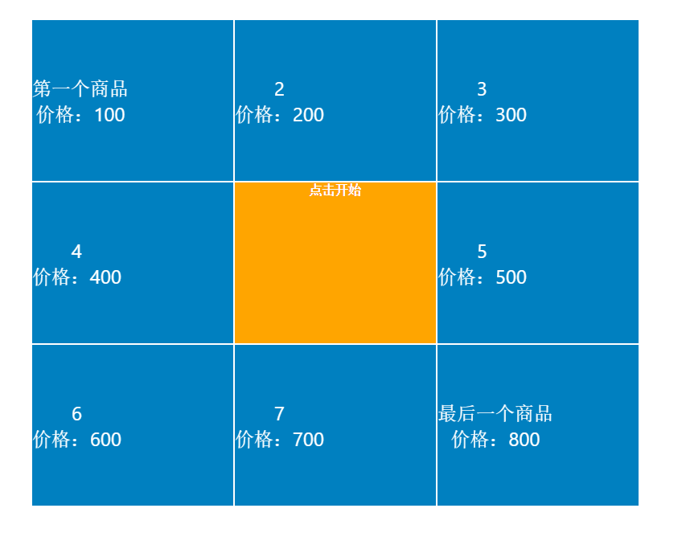
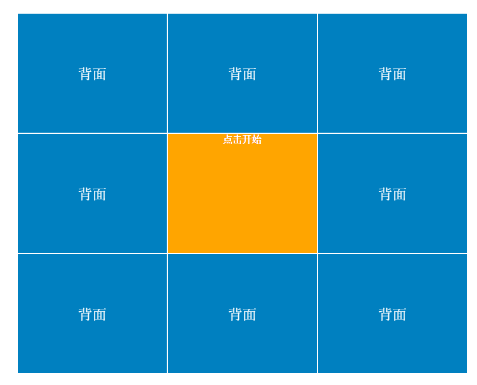

# jquery-lottery

类似天猫超市的翻牌效果

----------

参数说明：

 - front:    object 正面的数据
     - front.template：string 牌面显示的数据模板
     - front.data：Array 牌面数据，与模板的数据位对应
 - back：背面数据
 - startBtn：开始翻牌的按钮或图片
 - pick：翻牌事件
 - startLottery：点击“开始”的事件

使用方法：  

    <ul id="lot" class="lottery clearfix"></ul>
    
    $('#lot').lottery({
            front: {
                template: '
{{title}} 价格：{{price}}
',
                data: [
                    {title: '第一个商品', price: '100'}, 
                    {title: 2, price: '200'}, 
                    {title: 3, price: '300'}, 
                    {title: 4, price: '400'}, 
                    {title: 5, price: '500'}, 
                    {title: 6, price: '600'},
                    {title: 7, price: '700'}, 
                    {title: '最后一个商品', price: '800'}
                ]
            },
            back: '<a>背面</a>',
            startBtn: '<a>点击开始</a>',
            pick: function (i) {
                //翻牌的事件
                alert(i);
            },
            startLottery: function() {
                //开始的事件
                console.log('you clicked start button');
            }
        });

